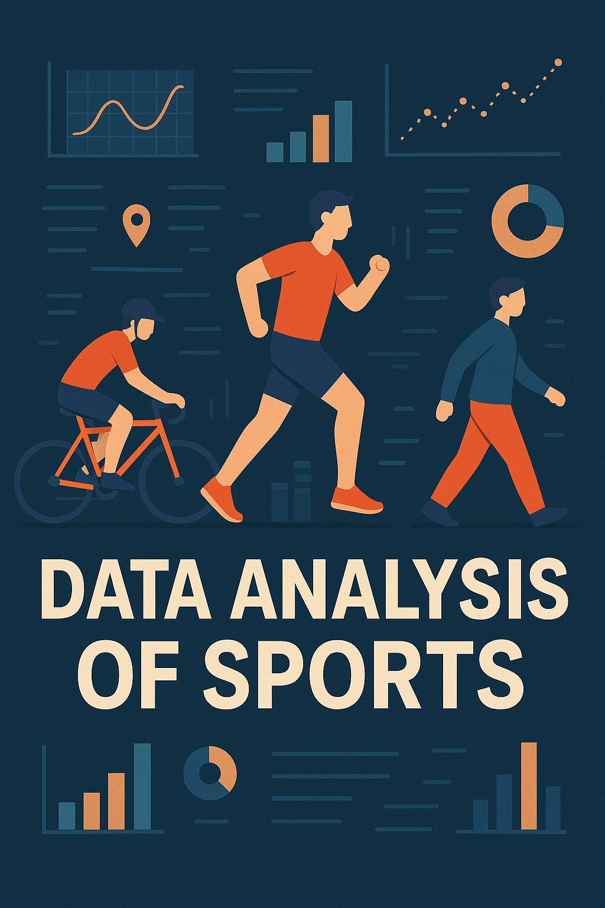

<!-- Image aligned to the right with max width -->
<p align="right">
  
</p>

<h1 style="color: teal;">Data Analysis of Sports</h1>

Welcome to the **Data Analysis of Sports** repository! 🏃‍♂️🚴‍♀️🚶‍♂️

This project explores and visualizes data from various sports activities such as cycling, running, and walking. It aims to uncover trends, performance insights, and actionable metrics using Python and modern data analysis tools.

### Features

- 📊 Interactive data visualizations
- 📍 GPS-based route mapping
- 📈 Performance trend tracking over time
- 🧠 Smart data filtering and grouping

### Tech Stack

- Python (Pandas, NumPy, Matplotlib, Plotly)
- Jupyter Notebooks
- OpenStreetMap / GPX route data
- GitHub Actions for workflow automation

## Getting Started

1. Clone the repository  
   ```bash
   git clone https://github.com/DrBAC/strava_code.git
   ```
2. Navigate to the project directory  
   ```bash
   cd sports-data-analysis
   ```
3. Install dependencies  
   ```bash
   pip install -r requirements.txt
   ```

## License

This project is licensed under the MIT License.

---

Feel free to use as a base for your own work
