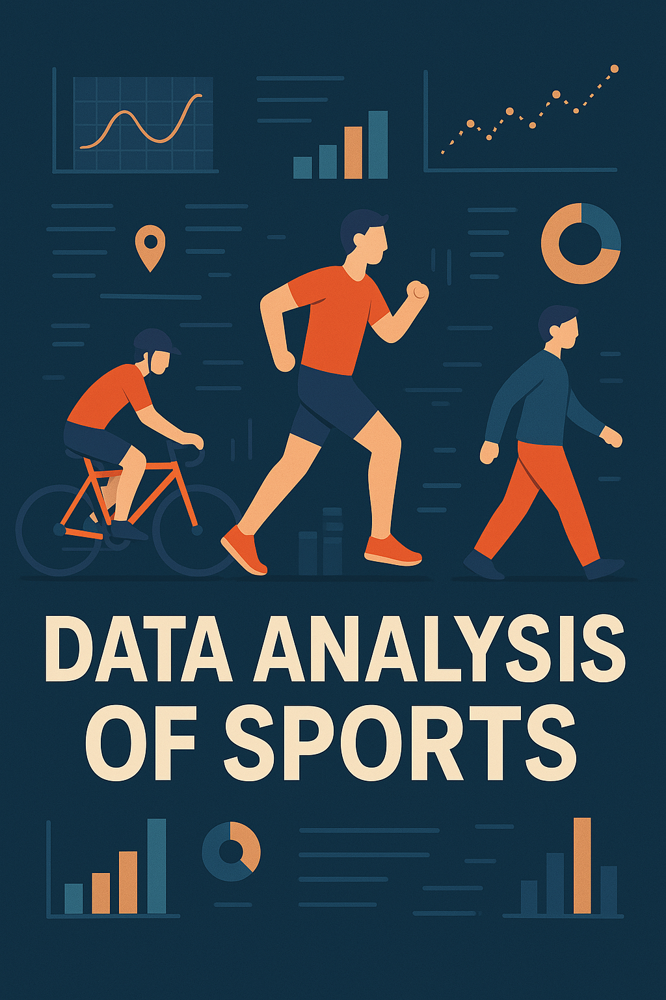

<!-- Image aligned to the right with max width -->
<p align="right">
  
</p>

<h1 style="color: teal;">Data Analysis of Sports</h1>

Welcome to the **Data Analysis of Sports** repository! 🏃‍♂️🚴‍♀️🚶‍♂️

This project explores and visualizes data from various sports activities such as cycling, running, and walking. It aims to uncover trends, performance insights, and actionable metrics using Python and modern data analysis tools.


## Overall Plan

- __Explore & munge data from extracted datasource__
- __Build a db, build the ETL, and insert data into local database__
- __Build Dash App to allow interrogation of training data, leveraging local db connection__
- __Cross correlate with Apple Health data and Weather data__
- __Explore wider data set to try and understand training e.g.:__
   - what does good performance look like (for me)?
   - do I perform better on warmer days?
   - do I perform better after significant rests?
   - can I automatically classify some training - what features enable this?

_I will be removing any personally identifiable information in here before anything is shared, but I will share the code I develop/use to do that_


### Features

- 📊 Interactive data visualizations
- 📍 GPS-based route mapping
- 📈 Performance trend tracking over time
- 🧠 Smart data filtering and grouping

### Tech Stack

- Python (Pandas, NumPy, Matplotlib, Plotly)
- Jupyter Notebooks
- OpenStreetMap / GPX route data
- GitHub Actions for workflow automation

## Getting Started

1. Clone the repository
   ```bash
   git clone https://github.com/DrBAC/strava_code.git
   cd strava_code
   ```
2. Create and activate a virtual environment
   ```bash
   python3 -m venv .venv
   source .venv/bin/activate
   ```
3. Install dependencies
   ```bash
   pip install -r requirements.txt
   ```
4. Place your Strava data export folder in the project root (the folder should be named `STRAVA+export_XXXXXXX`)

5. Run ingestion (DuckDB requires no further setup):
   ```bash
   python -m ingestion.run            # loads activities, routes, bikes
   python -m ingestion.run --streams  # also parses GPS/HR/power time-series (slow)
   ```

6. Open the exploration notebook:
   ```bash
   jupyter notebook exploration.ipynb
   ```
   Select the **Python 3 (.venv)** kernel and set `DB_BACKEND = "duckdb"` in the first cell.

---

## PostgreSQL Setup (Mac)

PostgreSQL is an optional alternative to DuckDB — useful if you want to connect Tableau or other BI tools that don't support DuckDB natively.

### 1. Install PostgreSQL via Homebrew

```bash
brew install postgresql@14
brew services start postgresql@14
```

Verify it's running:
```bash
psql --version
psql postgres   # should open a SQL prompt; type \q to exit
```

### 2. Create the database

```bash
createdb strava
```

No password is needed for a local Homebrew installation — your macOS username is automatically a trusted superuser.

### 3. Configure the .env file

Copy the example file and edit it:
```bash
cp .env.example .env
```

For a standard local Mac install, the only line you need in `.env` is:
```
PG_DSN=postgresql://YOUR_MAC_USERNAME@localhost:5432/strava
```

Replace `YOUR_MAC_USERNAME` with the output of `whoami` in your terminal. No password field is required.

### 4. Run ingestion to PostgreSQL

```bash
python -m ingestion.run --backend postgres
python -m ingestion.run --backend postgres --streams
```

### 5. Connect Tableau

In Tableau Desktop: **Connect → To a Server → PostgreSQL**

| Field    | Value       |
|----------|-------------|
| Server   | `localhost` |
| Port     | `5432`      |
| Database | `strava`    |
| Username | your macOS username |
| Password | *(leave blank)* |

> If Tableau reports a missing driver, go to **Help → Download Drivers** and install the PostgreSQL driver.

---

## GPS Privacy Anonymisation

Strava exports contain your precise home address embedded in every activity that starts or ends there. This project includes a two-step anonymisation pipeline to remove that before any data is shared or published.

### How it works

**Step 1 — Home zone trimming:** GPS points within a configurable radius of your home are stripped from the start and end of every track. The activity simply begins and ends at the zone boundary, with no data inside the radius.

**Step 2 — Anchor snapping:** Optionally, the first and last surviving GPS points are replaced with a specific public location of your choosing (e.g. a park entrance for runs, a road junction for rides). This gives each activity type a consistent, believable public start/end point.

Results are written to a separate `activity_streams_private` table. The original `activity_streams` data is never modified — the process is fully reversible.

### Setup

**1. Set your home coordinates in `.env`:**

Right-click your home on [Google Maps](https://maps.google.com) → *"What's here?"* to get the coordinates.

```
HOME_LAT=54.7601
HOME_LON=-1.5514
```

**2. Configure zones and anchor points in `privacy/config.py`:**

Open the file and edit the `ZONES` dictionary. Set `radius_m` for each activity type and, optionally, an `anchor` — the public location where that activity type will appear to start and end.

```python
ZONES = {
    "Ride": {"radius_m": 500, "anchor": (54.7631, -1.5541)},  # e.g. a road junction
    "Run":  {"radius_m": 300, "anchor": (54.7631, -1.5540)},  # e.g. a park entrance
    "Walk": {"radius_m": 200, "anchor": None},                 # trim only, no snap
    "default": {"radius_m": 300, "anchor": None},
}
```

To find anchor coordinates: right-click any point in Google Maps → *"What's here?"*

**3. Load stream data if you haven't already:**

```bash
python -m ingestion.run --streams            # DuckDB
python -m ingestion.run --backend postgres --streams  # PostgreSQL
```

**4. Run anonymisation:**

```bash
python -m privacy.run                        # DuckDB (default)
python -m privacy.run --backend postgres     # PostgreSQL
python -m privacy.run --replace              # re-run from scratch with new settings
python -m privacy.run --activity-id 12345678 # single activity (useful for testing)
```

### Using the anonymised data

Use the `activity_streams_private` table in place of `activity_streams` for any visualisations, dashboards, or exports you intend to share. The activities table and all summary metrics are unaffected — only the GPS track endpoints are altered.

| Table | Use for |
|-------|---------|
| `activity_streams` | Private analysis — contains real home location |
| `activity_streams_private` | Sharing, Tableau dashboards, public notebooks |

### Choosing good radius values

| Activity | Suggested radius | Rationale |
|----------|-----------------|-----------|
| Ride | 400–600 m | Cyclists cover this quickly; a larger zone avoids revealing the street |
| Run | 250–400 m | A couple of minutes of running |
| Walk | 150–250 m | Slower pace, smaller zone still effective |

If you are unsure, start with the defaults and run `--activity-id` on a known activity to inspect the result before processing everything.

---

## License

This project is licensed under the MIT License.

---

Feel free to use as a base for your own work
